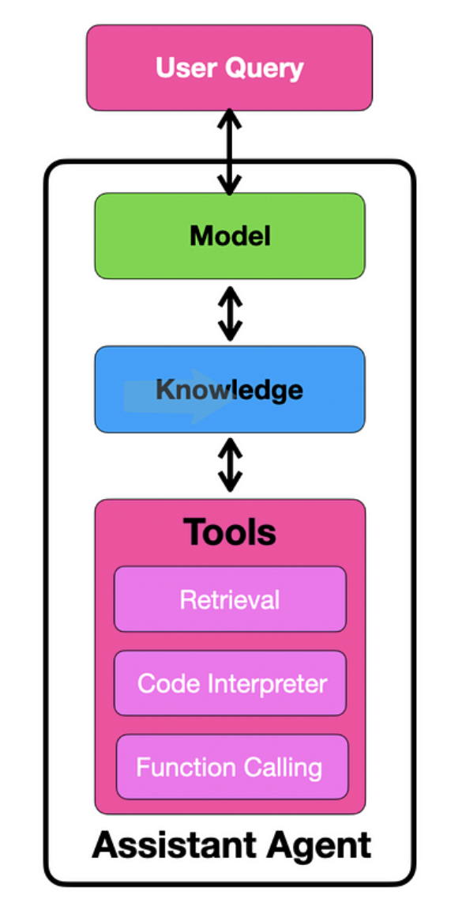

## References

See Youtube video <a href="https://youtu.be/CPlwcY5mQ_4?si=2OuCr5k_ztRoZfOL" target="_blank">OpenAI Assistants API + Node.js 🚀 How to get Started?</a> 
by Mervin Praison and the [blog post](https://mer.vin/2023/11/openai-assistants-api-in-node-js/). This was the starting point for this repo.

## Setup

```
➜  assistant-mervin-praison git:(main) ✗ node --version
v20.5.0
```

## Goals

- To learn how to use the OpenAI API to create an assistant, a thread, a message and a run
- How to check the status of the run and recover the result or error.
- No tools, no files, no retrieval

## Assistants

1. [Assistants](https://platform.openai.com/docs/assistants/how-it-works) can call OpenAI’s models with specific instructions to tune their personality and capabilities.
2. [Assistants](https://platform.openai.com/docs/assistants/how-it-works) can access multiple tools in parallel. These can be both OpenAI-hosted tools — like 
   1. [Code interpreter](https://platform.openai.com/docs/assistants/tools/code-interpreter) and 
   2. [Knowledge retrieval](https://platform.openai.com/docs/assistants/tools/knowledge-retrieval)  
   3. or tools you build / host (via [Function calling](https://platform.openai.com/docs/assistants/tools/function-calling)).
3. Assistants can access **persistent Threads**. Threads simplify AI application development by 
   1. storing message history and 
   2. **truncating it when the conversation gets too long** for the model’s context length.
   
   You create a Thread once, and simply append Messages to it as your users reply.
4. Assistants can access [Files](https://platform.openai.com/docs/assistants/tools/supported-files) in **several formats** — either as 
   1. part of their creation or 
   2. as part of Threads between Assistants and users. 
   3. **When using tools, Assistants can also create files** (e.g., images, spreadsheets, etc) and cite files they reference in the Messages they create.



## Run lifecycle


In order to keep the status of your run up to date, you will have to periodically [retrieve the Run object](https://platform.openai.com/docs/api-reference/runs/getRun). You can check the `status` of the run each time you retrieve the object to determine what your application should do next. 

```js

    let runStatus = await openai.beta.threads.runs.retrieve(threadId, runId);
    
    if (runStatus.status === "completed") {
        let lastMessageForRun = await getLastMessageForRun(openai, runId, threadId)
        console.log(purple("Last message for run: "+lastMessageForRun.content[0].text.value));
        //let allMessages = await getAllMessagesForThread(openai, threadId);
        //console.log(purple("All messages: "+inspect(allMessages)));
        process.exit(0);
    } else if (["failed", "cancelled", "expired"].includes(runStatus.status)) {
        console.error(
            red(`Run status is '${runStatus.status}'. Unable to complete the request.`)
        );
        process.exit(1);
    }
    else {
        console.log("Run is not completed yet.", blue(inspect(runStatus.status)));
        setTimeout(async () => { await checkStatusAndPrintMessages(thread.id, run.id) }, 
          assistantIds.delay || 9000);
    }
};

await checkStatusAndPrintMessages(thread.id, run.id);
```

OpenAI plans to add support for streaming to make this simpler in the near future.