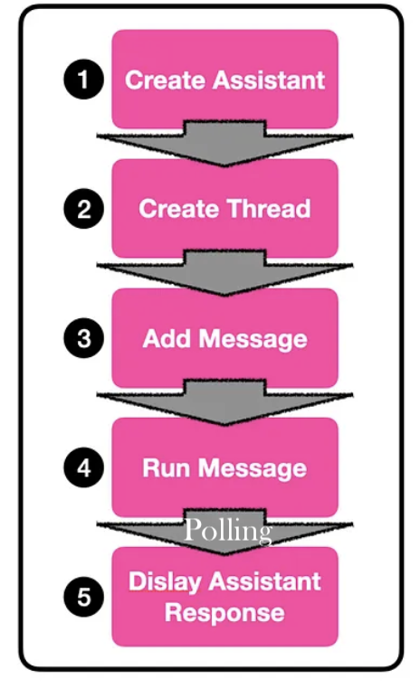

## References

See Youtube video <a href="https://youtu.be/CPlwcY5mQ_4?si=2OuCr5k_ztRoZfOL" target="_blank">OpenAI Assistants API + Node.js 🚀 How to get Started?</a> 
by Mervin Praison and the [blog post](https://mer.vin/2023/11/openai-assistants-api-in-node-js/). This was the starting point for this repo.

## Setup

```
➜  assistant-mervin-praison git:(main) ✗ node --version
v20.5.0
```

## Goals

- To learn how to use the OpenAI API to create an assistant, a thread, a message and a run
- How to check the status of the run and recover the result or error.
- No tools, no files, no retrieval

## Assistants

1. [Assistants](https://platform.openai.com/docs/assistants/how-it-works) can call OpenAI’s models with specific instructions to tune their personality and capabilities.
2. [Assistants](https://platform.openai.com/docs/assistants/how-it-works) can access multiple tools in parallel. These can be both OpenAI-hosted tools — like 
   1. [Code interpreter](https://platform.openai.com/docs/assistants/tools/code-interpreter) and 
   2. [Knowledge retrieval](https://platform.openai.com/docs/assistants/tools/knowledge-retrieval)  
   3. or tools you build / host (via [Function calling](https://platform.openai.com/docs/assistants/tools/function-calling)).
3. Assistants can access **persistent Threads**. Threads simplify AI application development by 
   1. storing message history and 
   2. **truncating it when the conversation gets too long** for the model’s context length.
   
   You create a Thread once, and simply append Messages to it as your users reply.
4. Assistants can access [Files](https://platform.openai.com/docs/assistants/tools/supported-files) in **several formats** — either as 
   1. part of their creation or 
   2. as part of Threads between Assistants and users. 
   3. **When using tools, Assistants can also create files** (e.g., images, spreadsheets, etc) and cite files they reference in the Messages they create.

| Components| Phases |
| ---       | --- |
|||

## Create an assistant


To get started, creating an Assistant only requires specifying the `model` to use. But you can further customize the behavior of the Assistant.

Use the `instructions` parameter to guide the personality of the Assistant and define it’s goals. Instructions are similar to system messages in the Chat Completions API. We can also 
use `openai.beta.assistants.retrieve(assistantId)` to retrieve an existing Assistant.

```js
const assistantIds = JSON.parse(fs.readFileSync("assistant.json", "utf8"));
import OpenAI from "openai";
const openai = new OpenAI();

let assistant = null;
if (assistantIds.assistant) {
    try {
        console.log("Retrieving assistant from assistantIds: ", assistantIds.assistant);
        assistant = await openai.beta.assistants.retrieve(assistantIds.assistant);
    } catch (e) {
        console.log(red("Error retrieving assistant: "), red(e));
        assistant = null;
    }
}
if (!assistant) {
    assistant = await openai.beta.assistants.create({
        name: assistantIds.name || "Math Tutor",
        instructions: assistantIds.instructions || "You are a personal math tutor. Write and run code to answer math questions.",
        tools: [] /* assistantIds.tools */,
        model: assistantIds.model,
    });
    assistantIds.assistant = assistant.id;
}
```
See the file [assistant.json](assistant.json) for the values of the parameters.

Use the `tools` parameter to give the Assistant access to up to **128 tools**. You can give it access to OpenAI-hosted tools like 
- `code_interpreter` and 
- `retrieval`, or 
- call a third-party tools via a `function calling`.
  
Use the `file_ids` parameter to give the tools like `code_interpreter` and `retrieval` access to files. Files are uploaded using the [File upload endpoint](https://platform.openai.com/docs/api-reference/files/create) and must have the `purpose` set to `assistants` to be used with this API. 

See the example at repo [ULL-prompt-engineering/assistant-file-retrieval-ralf](https://github.com/ULL-prompt-engineering/assistant-file-retrieval-ralf)

```js
const fileName = await askQuestion("Enter the filename to upload: ");

// Upload the file
const file = await openai.files.create({
    file: fs.createReadStream(fileName),
    purpose: "assistants",
});

// Retrieve existing file IDs from assistant.json to not overwrite
let existingFileIds = assistantDetails.file_ids || [];

// Update the assistant with the new file ID
await openai.beta.assistants.update(assistantId, {
    file_ids: [...existingFileIds, file.id],
});

// Update local assistantDetails and save to assistant.json
assistantDetails.file_ids = [...existingFileIds, file.id];
await fsPromises.writeFile(
    assistantFilePath,
    JSON.stringify(assistantDetails, null, 2)
);

console.log("File uploaded and successfully added to assistant\n");
```

## Run lifecycle


In order to keep the status of your run up to date, you will have to periodically [retrieve the Run object](https://platform.openai.com/docs/api-reference/runs/getRun). You can check the `status` of the run each time you retrieve the object to determine what your application should do next. 

```js

    let runStatus = await openai.beta.threads.runs.retrieve(threadId, runId);
    
    if (runStatus.status === "completed") {
        let lastMessageForRun = await getLastMessageForRun(openai, runId, threadId)
        console.log(purple("Last message for run: "+lastMessageForRun.content[0].text.value));
        //let allMessages = await getAllMessagesForThread(openai, threadId);
        //console.log(purple("All messages: "+inspect(allMessages)));
        process.exit(0);
    } else if (["failed", "cancelled", "expired"].includes(runStatus.status)) {
        console.error(
            red(`Run status is '${runStatus.status}'. Unable to complete the request.`)
        );
        process.exit(1);
    }
    else {
        console.log("Run is not completed yet.", blue(inspect(runStatus.status)));
        setTimeout(async () => { await checkStatusAndPrintMessages(thread.id, run.id) }, 
          assistantIds.delay || 9000);
    }
};

await checkStatusAndPrintMessages(thread.id, run.id);
```

OpenAI plans to add support for streaming to make this simpler in the near future.